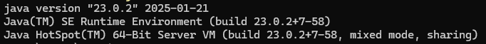

## Hudl.com

## 1. Implementation

I used IntelliJ IDE, JAVA as programming language, Selenium with JUnit as testing Framework and Maven as a build
management tool.

For this task I created BDD Cucumber Framework based on POM (Page Object Model) design pattern, because I wanted to have
an organised and easy to maintain Framework.

The project contains:

- pom.xml file where I keep all dependencies;
- features folder with scenarios written in Gherkin language;
- pages folder with locators;
- step_definitions package with coding logic written in JAVA ;
- Hooks class with before, after methods;
- Runner class to run the project;
- Configuration.properties file to keep data in one place (username, password, browser, baseURL);
- Utilities package with classes that contains reusable methods:
- Driver class where I initialise the driver using Singleton Design Pattern;
- ConfigurationReader is used to read .properties type of files;
- BrowserUtils with some reusable methods.
- I generate detailed html reports using maven-cucumber-reporting plugin and I take screenshots for the failed test
  cases.
- Login.feature where I created positive and negative scenarios using a set of different data.

Before to start automation testing, I performed manual testing for the login functionality.

I also used Scenario outline in order to use multiple data with the same code for increased coverage.

## 2. Project structure

    HudlProject
    ├── src
    │   ├── test
    │   │   └── java
    │   │        └── hudl   
    │   │               └── pages
    │   │                       └── BasePage
    │   │                       └── LoginPage
    │   ├── test
    │   │   └── java
    │   │       └── hudl   
    │   │             └── runners
    │   │                       └── CukesRunner
    │   ├── test
    │   │   └── java
    │   │        └── hudl   
    │   │               └── step_definitions
    │   │                       └── Hooks
    │   │                       └── LoginStepDefs
    │   ├── test
    │   │   └── java
    │   │        └── hudl   
    │   │               └── utilities
    │   │                       └── browserUtils
    │   │                       └── ConfigurationReader
    │   │                       └── Driver
    │   ├── test
    │   │   └── java
    │   │        └──resources   
    │   │               └── features
    │   │                       └── Login.feature
    ├── Configuration.properties
    ├── pom.xml
    └── ReadMe.md

## 3. How to run the project

### I. Install Prerequisites

#### A. Install Java

Ensure that Java 23 is installed on your machine.

- Download link: https://www.oracle.com/java/technologies/downloads/

If you do not have any experience with JAVA, please follow the videos bellow:

- for Windows OS: https://www.youtube.com/watch?v=R6MoDMASwag
- for Mac OS : https://www.youtube.com/watch?v=wXotUgqOdh8

Verify Java installation:

    java -version

##### B. Install Maven

Download and install Maven from Maven official website.

- Download link: https://maven.apache.org/download.cgi

If you do not have any experience with Maven, please follow the videos bellow:

- for Windows OS: https://www.youtube.com/watch?v=XEphzGQz-nI
- for Mac OS : https://www.youtube.com/watch?v=6l6f9PTi5hE

Verify Maven installation:

    mvn -v

### C. Install IDE

Download and install Community Edition IntelliJ from official website.

- Download link: https://www.jetbrains.com/idea/

Also, the project can run without IDE installation

### D. Install browser

Download and install Chrome or Firefox browser.

- Chrome browser download link: https://www.google.com/intl/en_uk/chrome/dr/download/
- Firefox browser download link: https://www.mozilla.org/en-GB/firefox/new/

To set the specific browser and also run headless, got to "Configuration.properties" and set value for "browser".

Examples:

    browser=chrome
    browser=chrome-headless
or

    browser=firefox
    browser=firefox-headless

## II. Clone project

Git Command:

    git clone 

## III. Run tests

#### A. For running the tests suit, you have to replace "validemail@gmail.com" and "validpassword" with a valid username and a valid password in "Configuration.properties" file.
    usernaem=validemail@gmail.com
    password=validpassword
#### B. Open command line and got to the project folder "HudlProject"

    cd <path of HudlProject project> 

#### C. Run Maven command for running the project

    mvn clean install test

## IV. Check reports

After running the previews step, Maven will create "target" folder where are stored all the reports.

For checking the report go to one of the following files (overview-features.htm or cucumber-reports.html) and open it
in any browser available.

    ├── target
    │      └── cucumber
    │      │       └── cucumber-html-reports   
    │      │                      └── overview-features.htm
    └──────└── cucumber-reports.html     